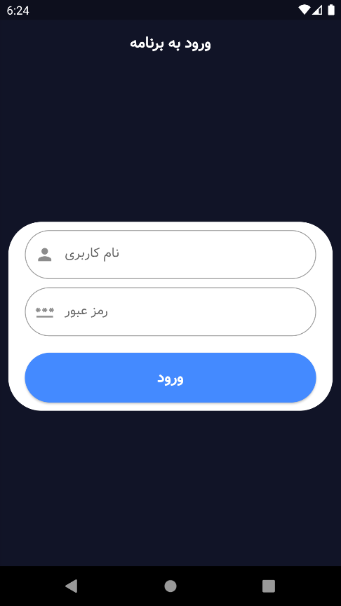
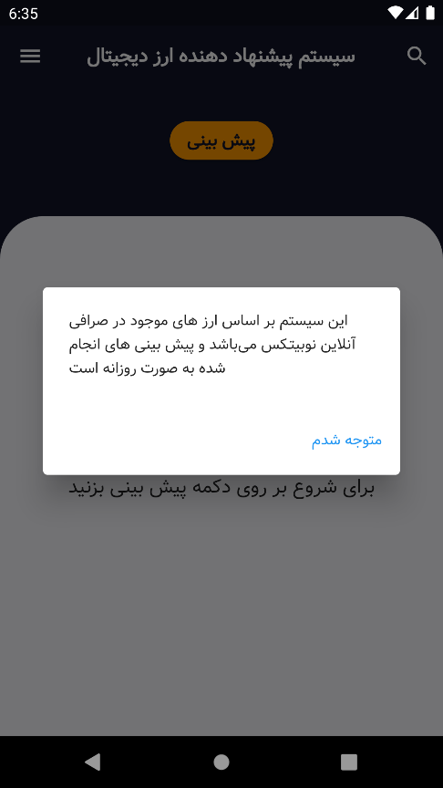
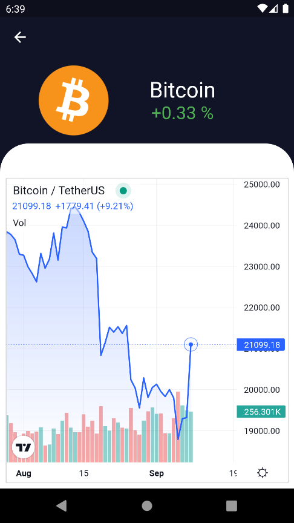
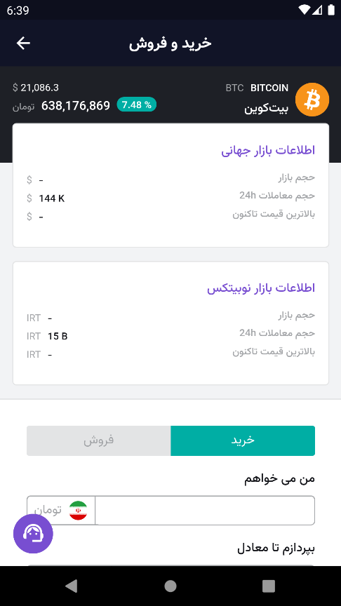
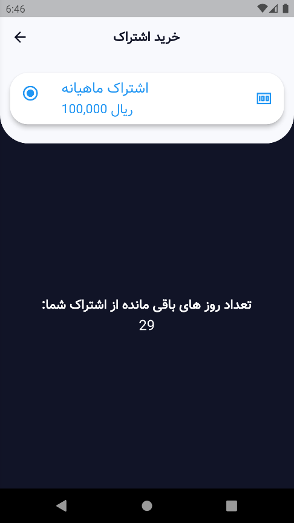

# 📱 Crypto RecommenderSystem App (Flutter)

This app is a crypto recommendation system designed to assist users by identifying and suggesting the most profitable cryptocurrencies based on trained AI algorithms. The goal is to support both novice and professional traders in making smarter buy/sell decisions.

---

## 🎯 Project Goals

- Help users select the most profitable cryptocurrencies
- Suggest coins based on real-time profit percentages
- Display live charts of price changes
- Enable buying/selling through Nobitex platform
- Generate revenue via in-app subscriptions

---

## 🛠 Technologies Used

- **Flutter** for UI development
- **Dart** as the programming language
- **Zarinpal** payment gateway for subscriptions
- **TradingView** for real-time price charts
- **Python Backend** via API
- **Flutter Packages**:
  - `fluttertoast` for notifications
  - `easy_web_view` for charts
  - `skeletons` for loading effects

---

## 🔍 Features

- List of cryptocurrencies with predicted profit percentages
- Search functionality among coins
- Real-time suggestions based on algorithmic analysis
- View live price change charts
- Subscription purchase through Zarinpal gateway
- Designed for Android devices

---

## 📷 Screenshots

<div align="center">
  
  
  
  
  
  
</div>

---

## 🚀 Installation & Run

### Prerequisites:
- Flutter SDK installed
- Android Studio or VS Code

### Run the project:

```bash
git clone https://github.com/AmirhosseinHY/crypto-predictor-app.git
cd crypto-predictor-app
flutter pub get
flutter run
```

---

## 📦 Download APK

You can download the latest APK version from the Releases section:

➡️ [Download APK](https://github.com/AmirhosseinHY/crypto-predictor-app/releases)

---

## 🧪 Testing

- Fully tested on a real Android device
- API, payment gateway, chart display, and predictions tested

---

## 👨‍💻 Developer

- **Name:** Amirhossein Homayouni
- **Python Backend (Recommender System) 🤝** [Alireza Fayazi](https://github.com/alirezafayazi)  
- **Supervisor:** Dr. Arash Khosravi  
- **Year:** Summer 2022

---
